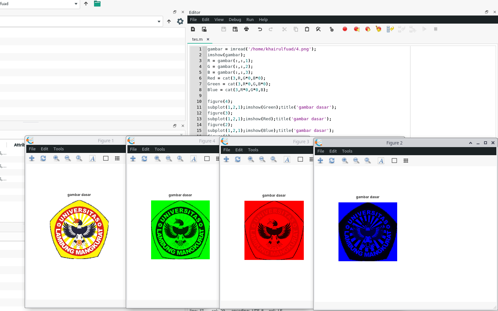
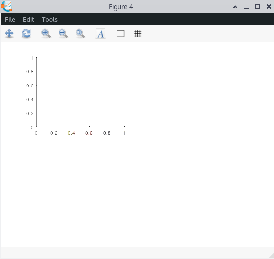
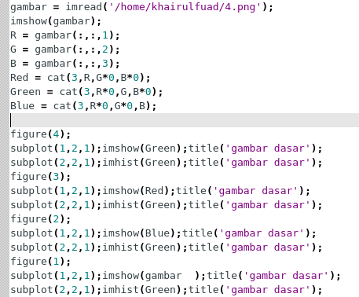

# Hasil Eksplorasi Octave menggunakan Package image

Dari gambar di atas dapat di simpulkan bahwa suatu gambar terbagi menjadi 3 layer yaitu layer Red, Green, dan Blue

### **imhist**
Penggunaan imhist ditujukan untuk menampilkan histogram dari sebuah gambar

### **imread**
Adapun fungsi imread, itu seperti membaca sebuah foto, jika pada html bisa seperti src di tag `` 

### **imshow**
Dan terakhir ada imshow untuk menampilkan fotonya atau gambar.

### **Eksplorasi yang lain**
Adapun beberapa hal yang saya dapat diluar imread, imhist, dan imshow, kita sebelumnya harus menentukan warna apa yg akan kita tampilkan, misal pada varial `Red = cat(R,G*0,B*0);` disini artinya menyimpan gambar yang terfokus pada layer merah saja dan juga untuk yang Blue, dan Green juga sama, hanya saja kita rubah yang R dikalikan 0 dan G tidak untuk di simpan di variabel Green.

Dan untuk menampilkan gambar sebelum imshow, kita juga memerlukan subplot untuk mengatur tata letak gambarnya.