## Khairul Fuad

## 2110131310002

## **GreyScale**

 Grayscale adalah berbagai nuansa warna monokromatik dari hitam menjadi putih. Oleh karena itu, gambar grayscale hanya memiliki warna abu-abu dan tidak berwarna.

di greyscale ada 3 method yaitu method lightness, average, dan luminosity.

### Lightness method

menggunakan rumus : 

grayscale = min(R,G,B)+max(R,G,B)/2

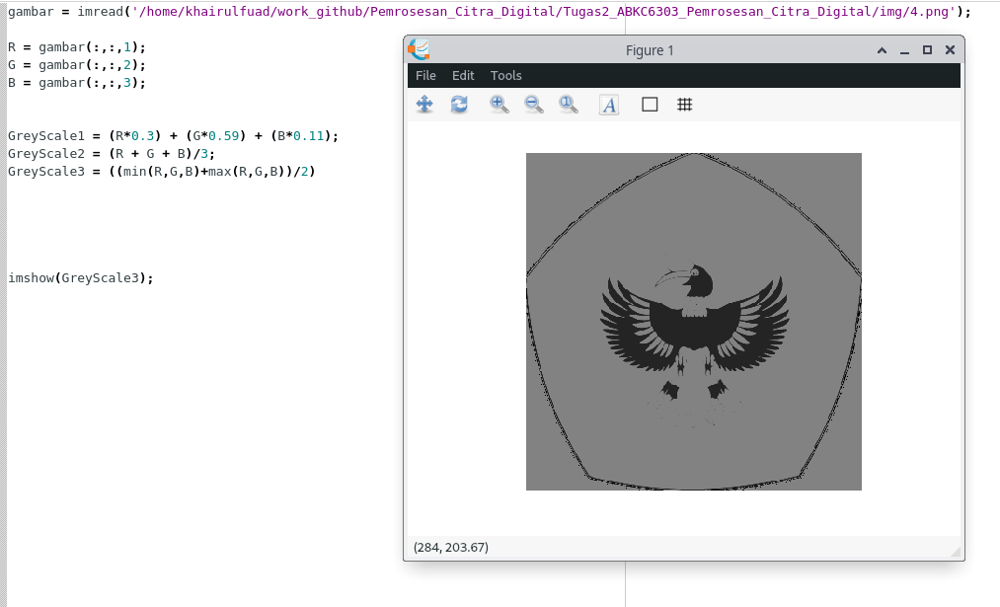

dapat dilihat pada gambar yang menggunakan lightness method memberikan kelemahan yaitu kelemahan karena jumlah cahaya yang dilihat mata kita tergantung pada 3 warna dasar, alasan kelemahan pada method ini yaitu hanya menggunakan satu komponen RGB tidak digunakan, bisa kita lihat pada rumus yang digunakan pada min hanya memilih 1 saja di antara RGB dan pada max juga demikian.

### Average method

menggunakan rumus : 

Grayscale : (R + G + B)/3

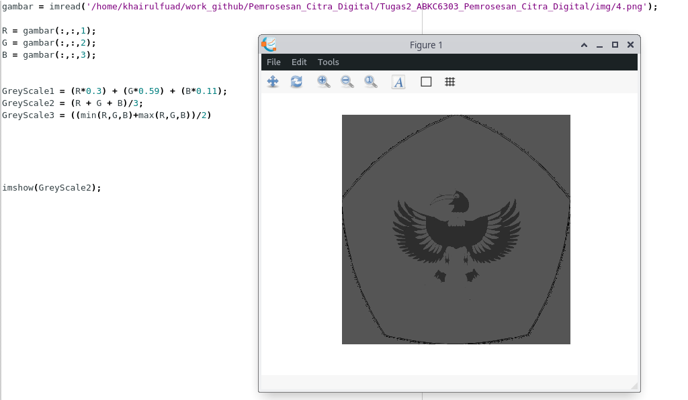

pada method ini juga mempunyai permasalahan yaitu pada pembagian bobot tiap warna dasar dengan nilai yang sama, sedangkan pada sebuah penelitian penglihatan manusia, bahwa mata manusia mempunyai reaksi yang berbeda pada tiap warna Secara khusus, mata kita lebih sensitif terhadap hijau, lalu merah, dan akhirnya biru. sehingga kita perlu mengubah bobot tiap warna.

### Luminousity method

menggunakan rumus : 

grayscale = 0.3 * R + 0.59 * G + 0.11 * B

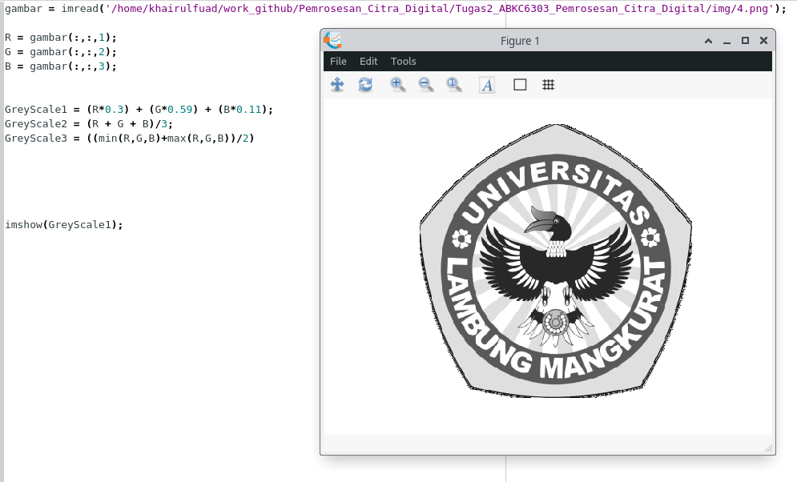

muncullah hasil yang demikian dari pengamatan average method, yang membuat Kontribusi warna biru pada nilai akhir harus berkurang, dan kontribusi warna hijau harus meningkat.

## Halftoning

Halftoning analog adalah proses yang mensimulasikan nuansa abu-abu dengan memvariasikan ukuran titik-titik hitam kecil yang diatur dalam pola yang teratur. Teknik ini digunakan dalam printer, serta industri penerbitan.

Elemen (atau titik yang digunakan halftoning dalam mensimulasikan nuansa abu-abu) dari sebuah gambar disimulasikan dengan mengisi sel halftone yang sesuai. Semakin banyak jumlah titik hitam dalam sel halftone, semakin gelap sel tersebut.

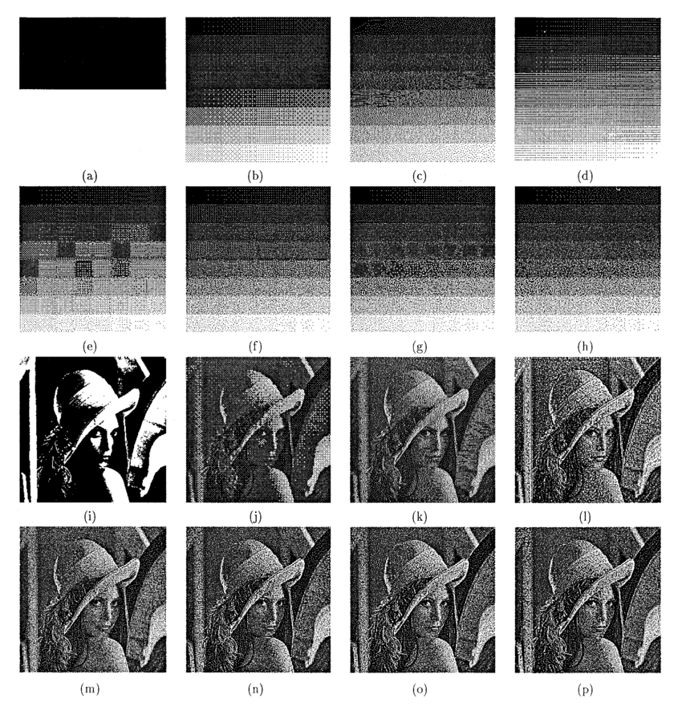

## Patterning

ola adalah yang paling sederhana dari tiga teknik untuk menghasilkan gambar halftoning digital. Ini menghasilkan gambar yang memiliki resolusi spasial lebih tinggi daripada gambar sumber. Jumlah sel halftone citra keluaran sama dengan jumlah piksel citra sumber. Namun, setiap sel halftone dibagi lagi menjadi kotak 4x4. Setiap nilai piksel input diwakili oleh jumlah kotak terisi yang berbeda dalam sel halftone. Karena kisi 4x4 hanya dapat mewakili 17 tingkat intensitas yang berbeda, gambar sumber harus dikuantisasi.

pattern menghasilkan gambar halftoning digital dari gambar input menggunakan teknik pola. Pola program membaca gambar input, mengkuantisasi nilai piksel, dan memetakan setiap piksel ke pola yang sesuai. Gambar yang dihasilkan 16 kali lebih besar dari aslinya. Gambar yang dihasilkan ditulis ke file output sebagai file TIFF. Sebuah kata peringatan: "pola" membutuhkan banyak perhitungan, gambar berukuran kurang dari 100x100 direkomendasikan.

## Dithering

Teknik lain yang digunakan untuk menghasilkan gambar halftoning digital adalah dithering. Tidak seperti pola, dithering membuat gambar keluaran dengan jumlah titik yang sama dengan jumlah piksel pada gambar sumber. Dithering dapat dianggap sebagai thresholding gambar sumber dengan matriks gentar. Matriks diletakkan berulang kali di atas gambar sumber. Dimanapun nilai piksel gambar lebih besar dari nilai dalam matriks, titik pada gambar output diisi. Masalah dithering yang terkenal adalah menghasilkan artefak pola yang diperkenalkan oleh matriks ambang batas tetap.

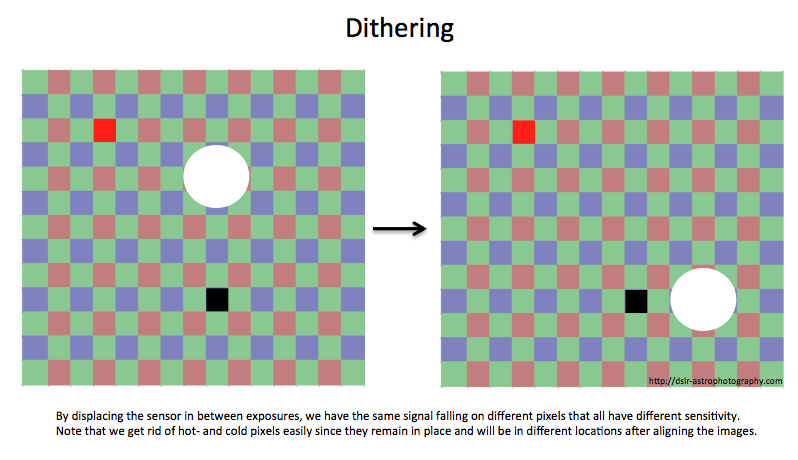

### Menentukan Pola

Karena sistem visual manusia cenderung meratakan suatu area di sekitar piksel, bukan melihat setiap piksel secara sendiri-sendiri, sehingga memungkinkan untuk membuat ilusi dari beberapa tingkat keabuan di dalam sebuah citra biner yang dalam kenyataanya hanya terdiri dari dua tingkat abu-abu. Dengan menggunakan matriks 2x2 piksel, lima nilai intensitas “efektif” yang berbeda dapat terwakili, seperti yang diilustrasikan pada Gambar 3. Demikian juga dengan matriks 4x4 piksel, sepuluh buah tingkat kabuan yang berbeda dapat terwakili. Metode ini disebut dengan dithering, dalam proses dithering blok asli pada citra kemudian akan diganti dengan jenis pola biner tersebut.

Lima pola berbeda dari matriks biner 2x2

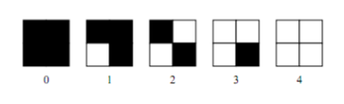

Ordered dithering dilakukan dengan membandingkan tiap blok dari citra asli dengan sebuah matriks pembatas yang disebut dengan matriks dither.Masing-masing elemen dari blok asli dikuantisasi sesuai dengan nilai batas pada pola dither. Nilai-nilai pada matriks ditheradalah tetap, tetapi bisa bervariasi sesuai dengan jenis citra.

Matriks dither pertama yang digunakan dalam metode ini adalah:

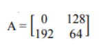

Matriks tersebut diulang sampai mencakup seluruh matriks pada citra yang diolah. Katakanlah d(i,j) adalah matriks yang diperoleh dari mereplika A dan x(i,j) adalah citra abu-abu asli. Piksel untuk citra yang dihasilkan p(i,j) didefenisikan sebagai berikut:

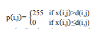

Hasil konversi citra abu-abu pada Gambar 1 menggunakan metode ordered dithering menggunakan matriks dither 2 x 2, ditunjukkan pada Gambar dibawah ini.

Citra matriks dithering 2x2

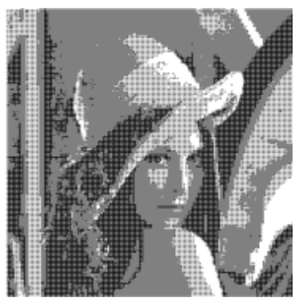

Selain matriks 2x2, teknik ini juga memiliki matriks dithering yang lainnya, yaitu 4x4 sebagai berikut.

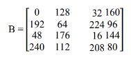

 Gambar dibawah ini menunjukkan citra yang dihasilkan dari penggunaan ordered dithering matriks 4x4.

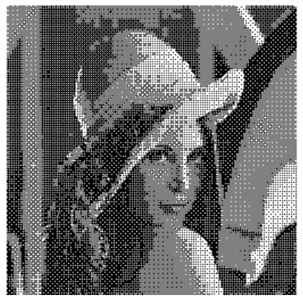

adapun dari reference lain cara menentukan dithering:

Pertama sekali, kami akan berusaha untuk melindungi. Dithering biasanya berfungsi untuk meningkatkan tahap awal. Semasa penegangan, tepi tajam muncul di mana kecerunan halus dalam gambar.

Di ambang, kita hanya memilih nilai tetap. Semua piksel di atas nilai tersebut dianggap sebagai 1 dan semua nilai di bawahnya dianggap sebagai 0.

Kami mendapat gambar ini selepas ambang.

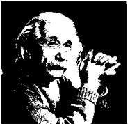

Oleh kerana tidak banyak perubahan pada gambar, kerana nilainya sudah 0 dan 1 atau hitam putih dalam gambar ini.

Sekarang kita melakukan pengurangan secara rawak. Ini adalah beberapa susunan piksel secara rawak.

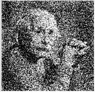

Kami mendapat gambar yang memberikan gambaran yang lebih ringan, tetapi kontrasnya sangat rendah.

Oleh itu, kita melakukan lebih banyak dithering yang akan meningkatkan kontras. Gambar yang kami dapat ialah:

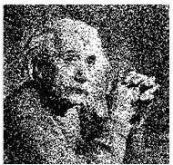

Sekarang kita mencampurkan konsep dithering rawak, bersama dengan ambang dan kita mendapat gambar seperti ini.

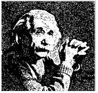

Sekarang anda lihat, kami mendapat semua gambar ini dengan hanya menyusun semula piksel gambar. Penyusunan semula ini dapat dilakukan secara acak atau mungkin sesuai dengan beberapa ukuran.

## menentukan tresholding

 Thresholding adalah metoda paling sederhana dari segmentasi citra. Dari citra grayscale thresholding dapat digunakan untuk membentuk citra biner. Sebuah citra biner adalah sebuah citra digital yang hanya memiliki dua kemungkinan nilai untuk tiap pixel. Kedua warna tersebut adalah hitam dan putih.

Dalam simple thresholding ini nilai ambang ditentukan secara manual antara 0 sampai 1. Dengan menggunakan thresholding maka derajat keabuan bisa diubah sesuai keinginan, misalkan diinginkan menggunakan derajat keabuan 16, maka tinggal membagi nilai derajat keabuan dengan 16. Proses thresholding ini pada dasarnya adalah proses pengubahan kuantisasi pada citra, sehingga untuk melakukan thresholding dengan derajat keabuan dapat digunakan rumus:

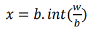

dimana:

w adalah nilai derajat keabuan sebelum thresholding

x adalah nilai derajat keabuan setelah thresholding
